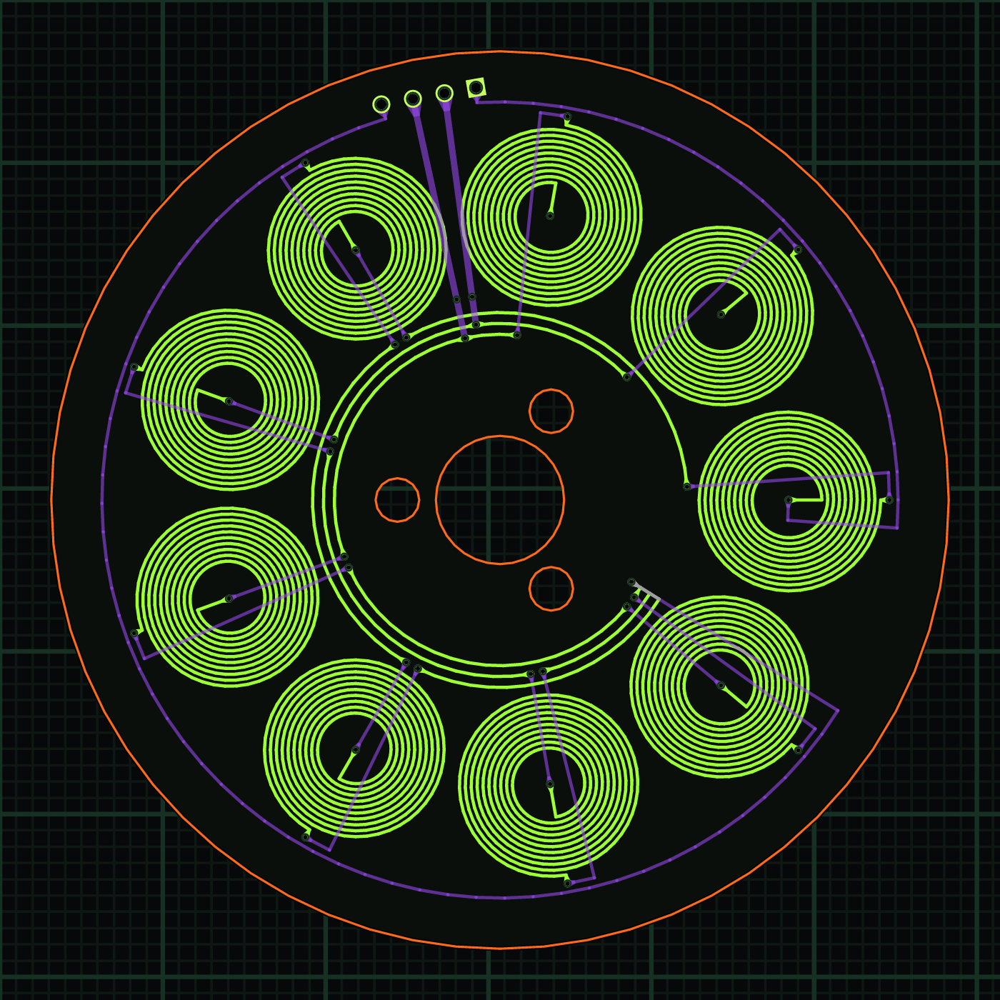

# PCB-Stator Axial-Flux Motor (rare-earth-free)

A 70 mm axial-flux motor whose stator is a 2-layer/2 oz PCB (9 slots / 6 poles,
3-phase wye) and whose field comes from ceramic Y30 ferrite discs — **zero
rare-earth content**. Designed, verified, and priced entirely through the vcad
MCP toolchain across three sessions; this example is the third (all-green) pass.

## What's here

| File | What |
|---|---|
| `stator-v3.vcad` | Winding board — DRC 0, receipt `31161edd73a2ca11` |
| `motor-assembly-v3.vcad` | Full assembly (board via `solid_from_board`, 11 parts) with named clearance assertions |
| `rotor-back-iron-v3.vcad`, `stator-back-iron-v3.vcad` | SendCutSend steel discs (2.7 mm mild steel) |
| `rotor-dragcup.vcad` | Optional all-copper induction rotor — **verified NOT to self-start** (margin 0.005 vs bearing friction); kept as an eddy-current demo |
| `motor-base.vcad` + `fab/motor-base.stl` | 3D-printed bearing tower (2× 608-ZZ) |
| `fab/BOM-v3.md` / `.csv` | Order-ready BOM, $269.32 landed, quote-linked |
| `fab/VERIFICATION-v3.md` | Tool-emitted verification ledger (+ v2 ledger for history) |
| `fab/stator-v3-gerbers/`, `fab/rotor-gerbers/` | Fab files |
| `scripts/pipeline.py` | The whole build+verify pipeline as one script |
| `scripts/mcp-bridge.mjs` | stdio→HTTP bridge for driving a local MCP build |

## Verified numbers

- PM config: B_gap 0.155 T (fringing-derated MEC), **Kt 3.7 mN·m/A**, ~7 mN·m @ 1.5 A,
  self-start margin **9.25** with 608-ZZ shielded bearings (2RS contact seals drop it
  to 1.39 — the bearing spec matters).
- Induction (coils-only) config: locked-rotor 18.5 µN·m — ~100× under bearing friction.
  Magnet-free PCB induction at this scale is a physics demo, not a motor.
- Clearances (kernel-measured, re-runnable): air gap 1.000 mm, magnet↔screw-heads
  3.15 mm, shaft↔bearing slip fit 0.0498 mm, plus three more — all asserted ≥ spec.

## Regenerating fab outputs

Everything derives from the `.vcad` files: `export_gerber` for boards, `export_cad`
(STEP) for the sheet-metal irons, `quote_manufacturing` / `sheet_metal_cost` for
prices, `scripts/pipeline.py` for the full pass including regression checks.
